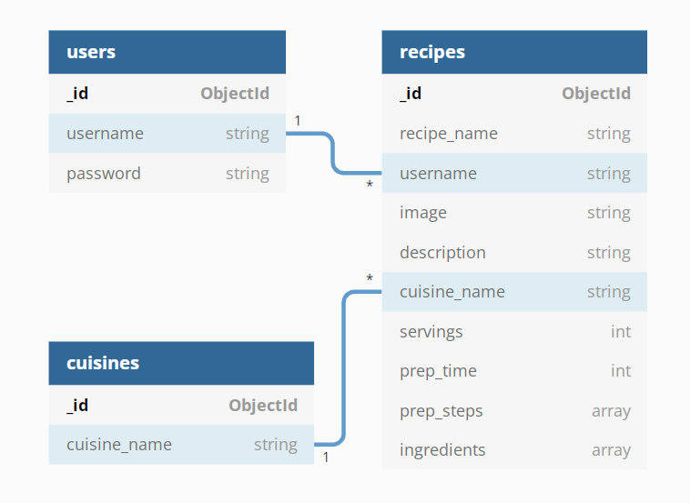

# Eatspiration | Data Centric Project 

## Project Overview

This is the third milestone project in obtaining a **Full-Stack Web Development Diploma** from  **[Code Institute](https://codeinstitute.net/)**. The purpose of this project is building a full-stack site that allows users to manage a common dataset about a particular domain. The required main technologies for this project are **HTML**, **CSS**, **Javascript**, **Python**, **Flask** and **MongoDB**. To improve the overall quality and user experience of this website other technologies were used as well. The full list of technologies used can be found in the technologies section of this document. 
Eatspiration is a recipe sharing website designed to help users find and share their own recipes with others.

**Please note: To open any links in this document in a new browser tab, please press CTRL + Click.**

View live website [here](https://eatspiration.herokuapp.com/).

---


---

## Table of content

- [Tradeoff table](#tradeoff-table)
- [User experience -UX-](#user-experience--ux-)
  - [User stories](#user-stories)
    - [As the site owner/admin](#as-the-site-owner/admin)
    - [As a new user](#as-a-new-user)
    - [As a returning user](#as-a-returning-user)
  - [Design](#design)
    - [Colour scheme](#colour-scheme)
    - [Typography](#typography)
    - [Wireframes](#wireframes)
    - [Database design](#database-design)
      - [Database diagram](#database-diagram)
- [Features](#features)
  - [Features implemented](#features-implemented)
    - [Navigation](#navigation)
    - [Security](#security)
    - [Managing data](#managing-data)
      - [Update database](#update-database)
      - [Delete cuisine](#delete-cuisine)
      - [Delete recipe:](#delete-recipe)
      - [Add or edit recipes](#add-or-edit-recipes)
      - [Recipe information](#recipe-information)
    - [Future features](#future-features)
- [Technologies](#technologies)
  - [Languages](#languages)
  - [Libraries and frameworks](#libraries-and-frameworks)
  - [Version control, workspace, repository storage and deployment](#version-control,-workspace,-repository-storage-and-deployment)
  - [Other technologies](#other-technologies)
- [Testing](#testing)
- [Deployment](#deployment)
  - [Deploy to Heroku](#deploy-to-heroku)
    - [Setup requirements](#setup-requirements)
    - [Setup Procfile](#setup-procfile)
  - [Heroku](#heroku)
    - [Create a new Heroku application](#create-a-new-heroku-application)
    - [Connecting to the GitHub repository](#connecting-to-the-github-repository)
    - [Setup the Config Vars](#setup-the-config-vars)
    - [Automatic deployment](#automatic-deployment)
  - [Local development](#local-development)
    - [Forking](#forking)
    - [Making a local clone](#making-a-local-clone)
- [Credits](#credits)
  - [Credit cuisine pictures](#credit-cuisine-pictures)

---

## Tradeoff table

Opportunity/Problem | Importance | Viability/Feasibility
--------------------|------------|-----------
The website being aesthetically pleasing | 5 | 5
User being able to log in/out to be able to use CRUD functionality | 5 | 5
An admin user being able to edit/delete any users data | 5 | 5
User being able to browse their own recipes as well as recipes added by other users | 5 | 5
User being able to search for recipes based on various searching criteria | 5 | 5
User being able to rate other recipes | 5 | 3
User can contact site owner/admin | 3 | 5

[Back to table of content](#table-of-content) 

---

## User Experience -UX-

### User stories

  #### As the site owner/admin

- As the owner/admin of the website, I want to be able to edit content to ensure it is conform the rules of the website.
- As the owner/admin of the website, I want the users of the website to have a positive user experience so that the community grows.
- As the owner/admin of the website, I want the users to be able to easily find, add, edit and be able to delete (their own) recipes to increase the number of recipes that are shared between users of the website.

[Back to table of content](#table-of-content) 

---

  #### As a new user

- As a new user, I want the website to be easily accessible from browsers of mobile devices as well as desktop.
- As a new user, I want to be able to easily see how to use the website, so I can start using the website effortlessly.
- As a new user, I want to be able to register with the site so that I can upload new recipes.
- As a newly registered user, I want to be able to log into my account so that I can access my recipes.

[Back to table of content](#table-of-content) 

---
  #### As a returning user

- As a returning user, I want to be able to search recipes by name so that I can find specific dishes.
- As a returning user, I want to be able to search recipes on cuisine type.
- As a returning user, I want to be able to be able to filter recipes based on cooking time.
- As a returning user, I want to be able to save my favourite recipes so that I can quickly find them again in the future.
- As a returning user, I want to be able to easily add, edit or delete my own recipes.
- As a returning user, I want feedback from the website when I add, edit or delete my recipes to show that my input is successfully processed.
- As a returning user, I want to be able to log out of the site when I am done using it.

[Back to table of content](#table-of-content) 

---

### Design

  #### Colour scheme


[Back to table of content](#table-of-content)

---

  #### Typography

The headers are in Roboto Slab with Roboto as backup lettertype, while the body text is in Roboto. Roboto Slab was chosen for the headers because it is bold and clear, while Roboto is easy to read and widely used on the web. Sans-serif will be the the backup in case neither one loads.

---

  #### Wireframes

Added [Wireframes](https://github.com/nowane/eatspiration/blob/main/docs/wireframes/wireframes-ms3.pdf) for desktop, tablet and mobile.

[Back to table of content](#table-of-content)


#### Database design

  ##### Database diagram




[Back to table of content](#table-of-content)

---

## Features

### Features implemented

  #### Navigation

- A navigation bar fixed at the top of each page which always keeps being displayed when the user scrolls. It displays links depending on wether the user is logged in or out, as well as the site name at the top-left side.
- Navigation buttons with associated information displayed in the navigation bar so that the user can navigate the site easily, including a "registration" and "login" option.
- A search field to allow first time visitors or logged in users to search for specific keywords for "recipe name" or it's "type of cuisine".
- A user 'Profile' page which will feature the recipes uploaded by the user so they can navigate to them directly.
- A footer at the bottom of the website, with the menu items links in them, as well as social media links.

[Back to table of content](#table-of-content)

---

  #### Security

The following features help to maintain security so that manipulation of the URL will not allow users to access to restricted areas or other users' profiles or privileges:

- The admin_required decorator function: Ensuring a user is "admin" before the user can gain access the admin's privileges.
- The login_required decorator function: Ensuring a user is logged in to access the wrapped functions' features.
- The not_logged_in decorator function: Ensuring a user is not logged in, before being able to access specific functions like being able to login or register.
- The registration and login function check for duplicate usernames, to ensure that the same username cannot be used to create or update a profile.
- Werkzeug security helpers 'generate_password_hash' and 'check_password_hash' used to hash the user password during registration.
The registeration function requires that the password is entered twice. A jQuery function checks whether the conformation password matches the initial password, and displays a message accordingly.

[Back to table of content](#table-of-content)

---

  #### Managing data

  ##### Update database

- The database generated document id's are used to reference relationships between documents from different collections within the database. This ensures that whenever information changes within a recipe (recipe_name, cuisine_type, description etc. ) that the front end will display the updated details automatically.

[Back to table of content](#table-of-content)

---

  ##### Delete cuisine

- A recipe must have a cuisine type. Whenever the admin deleted a specific cuisine, a recipe with that cuisine type will default back to the first choice alphabetically (A).

[Back to table of content](#table-of-content)

---

  ##### Delete Recipe

- Anything that references to the deleted recipe is also removed in the same delete action.

[Back to table of content](#table-of-content)

---

  #####  Add or edit recipes

- The image input requests an URL of the b the user uploaded image to be added with the recipe.
- The cuisine type collapsible is a list in alphabetical order of which the user can choose the correct match for the dish.
- Preperation steps and ingredients are added using the "add ingredient" and "add preperation step" buttons. Unlimited additional input fields for additional ingredients and instructions are allowed, however once they are added they are required. Empty fielde can't be submitted, so unnecessary fields of either two would have to be deleted first with the thrash icon next to the field.
- When editing a recipe, all ingredient and preperation step fields are displayed with a thrash icon next to it, and so all can be deleted if required.
- The remaining fields ("recipe name", "servings", "cooking time', "preperation time" and "description") have got accompanying helper-text and are self-explanatory.

[Back to table of content](#table-of-content)

---

  ##### Recipe information

The recipe card consists of information from different input fields, which is filled in by the user at the add_recipe page. The information inserted there is stored in three seperate collections in the eatspirations database at MongoDB The stored  information is as follows:
  - An add image field, where the user can insert the URL of an uploaded image of their recipe.
  - A field for the recipe name.
  - The amount of servings their dish has (integers).
  - A collection with predefined cuisine types.
  - Preperation time (integers)
  - Cooking time (integers).
  - A description field.
  - A button which when clicked, creates an input field for the used ingredients. There can be as many fields added as needed (array).
  - A button which when clicked, creates an input field for the preperation steps of the dish. There can be as many fields added as needed (array).

  Whenever a user edits a recipe they have submitted earlier, the earlier stored information is still in place, so the user does not need to fill out the whole page again.

[Back to table of content](#table-of-content)

---

### Future features

- Declaring advanced admin functionality to a user as well as implementation of different user roles.
- Giving the user the ability to request a new password whenever they have fotgotten their login credentials.
- Recipe recommendation based on what the user has favourited.
- Allow users to directly upload images instead of linking them with a URL.
- Adding favourites as a user.
- Favourites showing at the user profile.
- A rating system.
- Giving the user the possibility to comment on the recipes of other users.
- Advanced search filters, like filtering specifically on cuisine, rating, etc.
- Potentially some day a forum about food, inspiration, opninions and such.

[Back to table of content](#table-of-content)

---

## Technologies

  ### Languages

- [CSS](https://developer.mozilla.org/en-US/docs/Web/CSS) - Used to style and colour HTML as well as dynamic elements.

- [HTML](https://developer.mozilla.org/en-US/docs/Glossary/HTML5) - Used to structure the individual page(s) of the website.

- [Javascript](https://developer.mozilla.org/en-US/docs/Web/JavaScript) - Used to create and manipulate the dynamic elements of the website.

- [Jinja](https://jinja.palletsprojects.com/en/3.0.x/) - Used to generate HTML from templates.

- [Python](https://www.python.org/) - Used for the backend server and to run queries to the database.

[Back to table of content](#table-of-content) 

---

  ### Libraries and frameworks

- [Flask](https://flask.palletsprojects.com/en/2.0.x/) - Used micro-web framework to simplify web server tasks.
- [Font Awesome](https://fontawesome.com/)
- [Google Fonts](https://fonts.google.com/)
- [JQuery](https://jquery.com/) - Used to simplify DOM manipulation.
- [Materialize v1.0.0](https://materializecss.com/) - Used framework for this project.
- [Werkzeug](https://palletsprojects.com/p/werkzeug/) - Used the Werkzeug WSGI library to manage the Web Server Gateway Interface and related tasks.

[Back to table of content](#table-of-content) 

---

  ### Version control, workspace, repository storage and deployment

- [Git](https://git-scm.com/) - Version control software used to commit and push code to the GitHub repository where the source code is stored.
- [Gitpod](https://www.gitpod.io/) - Main workspace IDE (Integrated Development Environment).
- [GitHub](https://github.com/) - Used to store the project repository and deploy the website via github pages.
- [Heroku](https://www.heroku.com/platform) - Platform used to deploy this project.

[Back to table of content](#table-of-content) 

---

  ### Other technologies

- [Balsamiq](https://balsamiq.com/) - Used to create wireframes for the UX stage of the project.
- [DBdiagram](https://dbdiagram.io/) - Flowchart and database design illustration.
- [Favicon](https://favicon.io/) - for generating 32x32 favicon.
- [Google Chrome Developer Tools](https://developer.chrome.com/docs/devtools/) - Used throughout building the project testing responsiveness and debugging.
- [MongoDB](https://www.mongodb.com/) - database technology used for this project.
- [Slack](https://slack.com/intl/en-nl/) - Used to look up answers to all kind of questions.

[Back to table of content](#table-of-content)

---

## Testing

This [testing document](https://github.com/nowane/eatspiration/blob/main/TESTING.md)  contains all testing.

[Back to table of content](#table-of-content)

---

## Deployment

### Deploy to Heroku

  #### Setup requirements

Make sure "requirements.txt" is always up to date.  
Requirements.txt tells Heroku what resources are needed to run the app.

1.  Go to the Bash Terminal.
2.  Type the following: ```pip3 freeze --local > requirements.txt``` 
3.  Push all changes to GitHub.

[Back to table of content](#table-of-content)

---

  #### Setup Procfile

Heroku looks for this Procfile to find out which file runs the app and how to run it.

1.  Go to the Bash Terminal.
2.  Type the following: ```echo web: python app.py > Procfile```
3.  Open the Procfile and delete an empty line if there is one. It could potentially cause problems with Heroku.
4.  Push the file to GitHub.

[Back to table of content](#table-of-content)

---

### Heroku

  #### Create a new Heroku application

1.  Go to the Heroku Dashboard.
2.  Click New.
3.  Select to create a new app.
4.  The Heroku app name must be unique, use "–" instead of spaces, and use lower case letters.
5.  "eatspiration" is the name of this application.
6.  Select the region closest to you.
7.  Click "create app".

[Back to table of content](#table-of-content)

---

  #### Connecting to the GitHub repository

You can connect in different ways, like via the Heroku Command Line Interface as explained on the Heroku site. It's simpler however to deploy the site from Github. This way you only need to push to GitHub.

1.  Select Github, from the "Deployment method" section, on the "Deploy" tab.
2.  Make sure your GitHub ID is displayed and then enter the GitHub repository name "eatspiration" and click search.
3.  Once it finds the repository, click connect, to connect to the repository.

[Back to table of content](#table-of-content)

---

  #### Setup the Config Vars

Because of the hidden environment variables inside the env file which are not available to Heroku, attempting to deploy at this stage would result in application errors. 

1.  Click on "Settings".
2.  Click on "Reveal Config Vars".
3.  Here we tell Heroku what secret variables are required. 
Add the Key-Value pairs as follows, without quotes:
``` 
    IP : 0.0.0.0   
    PORT: 5000   
    SECRET_KEY: ################
    MONGO_URI : mongodb+srv://root:<MONGO-PASSWORD>@myfirstcluster.ugdke.mongodb.net/<APP-NAME>?retryWrites=true&w=majority   
    MONGO_DBNAME: app_name
```  
**Note: you will get this information from the local copy of the env file.**

[Back to table of content](#table-of-content)

---

  #### Automatic deployment

Once the Config Vars has been entered you are ready for automatic deployment.

1.  Click on the "Deploy" tab.
2.  Click "Enable Automatic Deploys".
3.  Select the master branch.
4.  Click "Deploy Branch".

The project is now deployed.

[Back to table of content](#table-of-content)

---

### Local development

  #### Forking

You can make a copy of the GitHub Repository by "forking" the original repository onto your own account, where changes can be made without affecting the original repository by taking the following steps: 
   
1. Login to your account on [GitHub](https://github.com/).
2. Locate the [repository](https://github.com/nowane/eatspiration) of this project.
3. On the right-hand side of the repository name, you'll see the "Fork" button.
4. This will create a copy in your personal repository.
5. Once you're finished making changes, return to original repository and press "New Pull Request" to request your changes to be merged into the original project.

[Back to table of content](#table-of-content)

---

  #### Making a local clone

1. Log in to [GitHub](https://github.com). 
2. Locate the [GitHub repository](https://github.com/nowane/eatspiration).
3. Underneath the repository name, click "Code".
4. To clone the repository, select "HTTPS" and copy the link.
5. Open Git Bash.
6. Change the current working directory to the location where you want the cloned directory to be made.
7. Type "git clone", and then paste the URL copied from step 4.
```
    git clone https://github.com/nowane/eatspiration
```
7. After pressing the "Enter" key, your local clone will be created.
8. Change into the directory being created.

Click [Here](https://help.github.com/en/github/creating-cloning-and-archiving-repositories/cloning-a-repository) for more information about cloning repositories. 

[Back to table of content](#table-of-content)

---

## Credits

- Looked at this [Youtube video](https://www.google.com/search?q=How+to+add+line+divider+for+menu+item&rlz=1C1VDKB_nlNL944NL944&sxsrf=AOaemvIWM2JneOlrQ8TRwr-0b7OJBRtxbw%3A1633248622660&ei=bmVZYczYJ4WQkwXQnIXoDg&ved=0ahUKEwjMx-6f5a3zAhUFyKQKHVBOAe0Q4dUDCA4&uact=5&oq=How+to+add+line+divider+for+menu+item&gs_lcp=Cgdnd3Mtd2l6EAMyBAgAEBNKBAhBGABQijVYijVg0DZoAHABeACAAXeIAXeSAQMwLjGYAQCgAQKgAQHAAQE&sclient=gws-wiz#kpvalbx=_2G5ZYebFPILksAehqJOgAw22) which is about vertical menu dividers 

- [Stack overflow](https://stackoverflow.com/questions/19605150/regex-for-password-must-contain-at-least-eight-characters-at-least-one-number-a) regarding regex fir passwords.

- [Materialize](https://materializecss.com/) documentation regarding a lot of different matters.

[Back to table of content](#table-of-content)

---

  ### Credit cuisine pictures

- American:[Kelly Visel](https://images.unsplash.com/photo-1602030638412-bb8dcc0bc8b0?ixid=MnwxMjA3fDB8MHxwaG90by1wYWdlfHx8fGVufDB8fHx8&ixlib=rb-1.2.1&auto=format&fit=crop&w=1171&q=80)
- Asian:[Trung Bui](https://images.unsplash.com/photo-1527997921830-de1cf1f9b430?ixid=MnwxMjA3fDB8MHxwaG90by1wYWdlfHx8fGVufDB8fHx8&ixlib=rb-1.2.1&auto=format&fit=crop&w=907&q=80) 
- Argentinian:[Louis Hansel](https://images.unsplash.com/photo-1556269923-e4ef51d69638?ixid=MnwxMjA3fDB8MHxwaG90by1wYWdlfHx8fGVufDB8fHx8&ixlib=rb-1.2.1&auto=format&fit=crop&w=1078&q=80)
- Brazilian:[Junior Reis](https://images.unsplash.com/photo-1612871689142-89f4e9043cd9?ixid=MnwxMjA3fDB8MHxwaG90by1wYWdlfHx8fGVufDB8fHx8&ixlib=rb-1.2.1&auto=format&fit=crop&w=2070&q=80)
- Comfort:[Chad Montano](https://images.unsplash.com/photo-1567620905732-2d1ec7ab7445?ixid=MnwxMjA3fDB8MHxwaG90by1wYWdlfHx8fGVufDB8fHx8&ixlib=rb-1.2.1&auto=format&fit=crop&w=780&q=80)
- Drinks:[Moritz Mentges](https://images.unsplash.com/photo-1582106245687-cbb466a9f07f?ixid=MnwxMjA3fDB8MHxwaG90by1wYWdlfHx8fGVufDB8fHx8&ixlib=rb-1.2.1&auto=format&fit=crop&w=1169&q=80)
- Dutch:[Grooveland Designs](https://images.unsplash.com/photo-1611835116500-03c9eb3c7200?ixid=MnwxMjA3fDB8MHxwaG90by1wYWdlfHx8fGVufDB8fHx8&ixlib=rb-1.2.1&auto=format&fit=crop&w=1630&q=80)
- English:[Eiliv-Sonas Aceron](https://images.unsplash.com/photo-1533920379810-6bedac961555?ixid=MnwxMjA3fDB8MHxwaG90by1wYWdlfHx8fGVufDB8fHx8&ixlib=rb-1.2.1&auto=format&fit=crop&w=1974&q=80)
- French:[Keriliwi](https://images.unsplash.com/photo-1608855238293-a8853e7f7c98?ixid=MnwxMjA3fDB8MHxwaG90by1wYWdlfHx8fGVufDB8fHx8&ixlib=rb-1.2.1&auto=format&fit=crop&w=1170&q=80)
- German:[Mark König](https://images.unsplash.com/photo-1599921841143-819065a55cc6?ixid=MnwxMjA3fDB8MHxwaG90by1wYWdlfHx8fGVufDB8fHx8&ixlib=rb-1.2.1&auto=format&fit=crop&w=1631&q=80)
- Healthy:[Dan Gold](https://images.unsplash.com/photo-1498837167922-ddd27525d352?ixid=MnwxMjA3fDB8MHxwaG90by1wYWdlfHx8fGVufDB8fHx8&ixlib=rb-1.2.1&auto=format&fit=crop&w=1170&q=80)
- Italian:[Chad Montano](https://images.unsplash.com/photo-1565299624946-b28f40a0ae38?ixlib=rb-1.2.1&ixid=MnwxMjA3fDB8MHxwaG90by1wYWdlfHx8fGVufDB8fHx8&auto=format&fit=crop&w=781&q=80)
- Irish:[Adrien Sala](https://images.unsplash.com/photo-1448043552756-e747b7a2b2b8?ixid=MnwxMjA3fDB8MHxwaG90by1wYWdlfHx8fGVufDB8fHx8&ixlib=rb-1.2.1&auto=format&fit=crop&w=1052&q=80)
- Vegan:[Sonny Mauricio](https://images.unsplash.com/photo-1623428187969-5da2dcea5ebf?ixlib=rb-1.2.1&ixid=MnwxMjA3fDB8MHxwaG90by1wYWdlfHx8fGVufDB8fHx8&auto=format&fit=crop&w=1964&q=80)
- Vegetarian:[Ralph (Ravi) Kayden](https://images.unsplash.com/photo-1599020792689-9fde458e7e17?ixid=MnwxMjA3fDB8MHxwaG90by1wYWdlfHx8fGVufDB8fHx8&ixlib=rb-1.2.1&auto=format&fit=crop&w=1976&q=80)

[Back to table of content](#table-of-content)

---