# Testing

## Table of Content

- [Manual testing of each section of the site](#manual-testing-of-each-section-of-the-site)
- [Testing site responsiveness](#testing-site-responsiveness)
- [Code validation](#code-validation)
    - [HTML](#html)
    - [CSS](#css)
    - [Javascript](#javascript)
- [Testing of user stories](#testing-of-user-stories) 
    - [Testing as a new user](#testing-as-a-new-user)
    - [Testing as a returning user](#testing-as-a-returning-user)
- [Documentation of any bugs encountered and their resolution steps](#documentation-of-any-bugs-encountered-and-their-resolution-steps)
- [Documentation of any open bugs](#documentation-of-any-open-bugs)

---

## Manual testing of each section of the site

[Back to table of content](#table-of-content)

---

## Testing site responsiveness 

A mockup of the project, displaying responsiveness.

[Back to table of content](#table-of-content)

---

## Code validation

### HTML

Code validated using https://validator.w3.org/ .

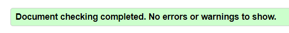

[Back to table of content](#table-of-content)

---

### CSS

Code validated using https://jigsaw.w3.org/css-validator/ .

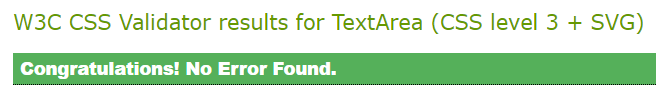

[Back to table of content](#table-of-content)

---

### Javascript

Code validated using https://jshint.com/ .

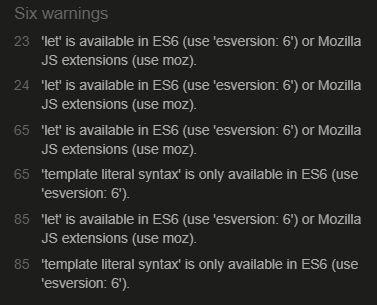

ES6 as used. Besides that the validator had trouble handling the jQuery  "$"  declaration sign.

[Back to table of content](#table-of-content)

---

### Python

Code validated using http://pep8online.com/ .

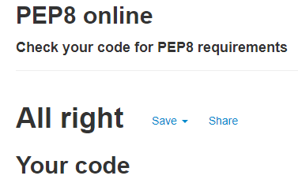

[Back to table of content](#table-of-content)

---

## Testing of user stories.

  ## Testing as the site owner

- As the owner/admin of the website, I want to be able to edit content to ensure it is conform the rules of the website.
> If the admin is logged in, in the recipe overview the cards show both an edit and a delete button, for whenever a foul entry is found. In a future version the admin will be able to edit comments/reviews as well.

- As the owner/admin of the website, I want the users of the website to have a positive user experience so that the community grows.
> When the user enters the site, a page is showing recipes so the user can straight away dive in for inspiration. The navigation bar and footer clearly show options for the user to register or login if wanted as well.

- As the owner/admin of the website, I want the users to be able to easily find, add, edit and be able to delete (their own) recipes to increase the number of recipes that are shared between users of the website.
> When the user enters the website, the first thing they'd see is a big search bar where they can (at the moment) search on either "recipe name" or "cuisine name". More search options are yet to be added.
> Any recipe a user uploads, another user can find in the database, so sharing and finding net recipes is easy. An option to add personal favourites is yet to be added.

[Back to table of content](#table-of-content)

---

  ### Testing as a new user

- As a new user, I want the website to be easily accessible from browsers of mobile devices as well as desktop.
> The website is fully responsive,and easy to navigate on devices of all sizes.

- As a new user, I want to be able to easily see how to use the website, so I can start using the website effortlessly.
> A new user can easily dive in already existing recipes to look for inspiration, as well as sign up easily by simply registering with a username and password. After registration and logging in, the user is in a position of starting to submit recipes as well.

- As a new user, I want to be able to register with the site so that I can upload new recipes.
> The user can easily register on the website.

- As a newly registered user, I want to be able to log into my account so that I can access my recipes.
> The user can at any given time access their recipes, by either just reading, editing er deleting them. At this point however, the user has not yet got the option to keep all recipes central at their profile page.

[Back to table of content](#table-of-content)

---

  ### Testing as a returning user

- As a returning user, I want to be able to search recipes by name so that I can find specific dishes.
> The user can search on recipe name in the search bar.

- As a returning user, I want to be able to search recipes on cuisine type.
> The user can search on cuisine typee in the search bar.

- As a returning user, I want to be able to be able to filter recipes based on cooking time.
> This is not yet implemented in this version, but more advanced search options will be added at a later time.

- As a returning user, I want to be able to save my favourite recipes so that I can quickly find them again in the future.
> At this point the user has not yet got the option to keep all recipes central at their profile page by adding them to favourites. This will be added in the next release.

- As a returning user, I want to be able to easily add, edit or delete my own recipes.
> The user can easily add, edit or delete their own recipes.

- As a returning user, I want feedback from the website when I add, edit or delete my recipes to show that my input is successfully processed.
> Whenever such an action is done, there will be a message at the top of the screen telling the user wether or not their input was successfully processed.

- As a returning user, I want to be able to log out of the site when I am done using it.
> The user can safely log out of the website when done browsing.

[Back to table of content](#table-of-content)

---

## Documentation of any bugs encountered and their resolution steps

- When adding the footer at the bottom at the page without being fixed using flexbox, there was a small gap of white space underneath the footer. According to devtools this was caused by an "I"-element with the classname of "material-icons". See images below.

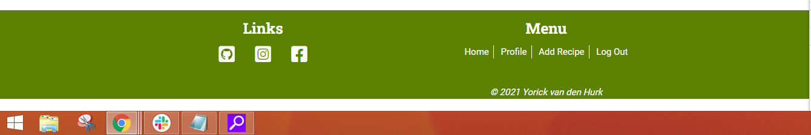 
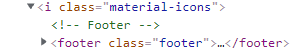 

> This was solved deleting the last "row" class in the div with my name in it, since apparently this caused the white space. Deleting the whole div with the name in it still caused the space te appear. Because of this I decided on keeping the bottom div in the footer, and keep the name in it hidden. See image below.

 

[Back to table of content](#table-of-content)

---

- The "Add Recipe"-page seemed to have issues with responsiveness when resizing via the "Toggle device toolbar". I thought this perhaps had something to do with Materialize and the fact using the "row" class sometimes gives extra whitespace, similar to how it affected the footer. See image below.

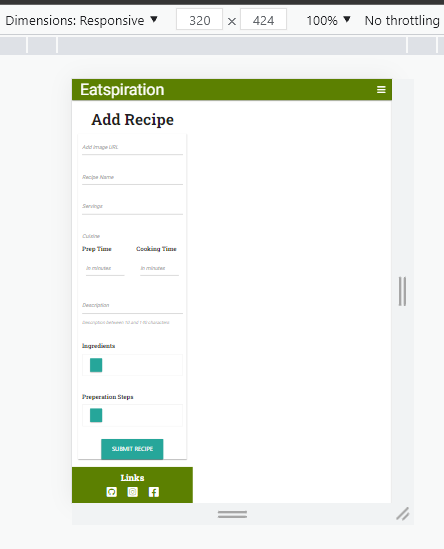 

> After a lot of fiddling around I found out by accident that whenever you load the screen with a small device as starting point, the page would actually load as intended. See image below.

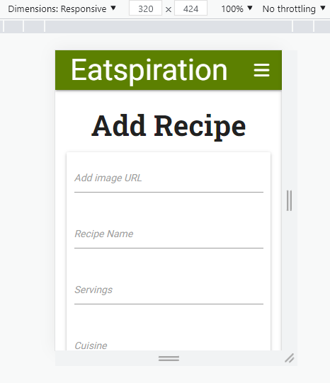

[Back to table of content](#table-of-content)

---

- At the "Edit Recipe" page there was an issue where whenever you changed data and submitted all was saved correctly. However when submitting the for whenever there were no changes deleted the preparation steps, which were inserted in a textarea element.

> This was resolved by editing the input element of the preparation steps, which is now the same as the ingredients input.

---

- A KeyError occured when the admin-user tried clicking the button to add a "Cuisine Type".

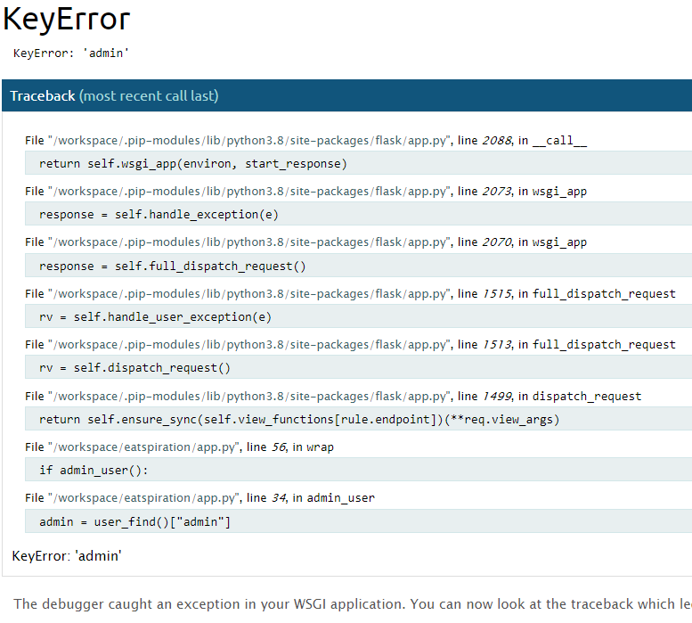

> After some fiddling it became clear that the admin user was not called correctly in the "admin_user():" function. This was corrected.

[Back to table of content](#table-of-content)

---

- After implementing pagination on the "recipes" page, the following error occured after doing a query:

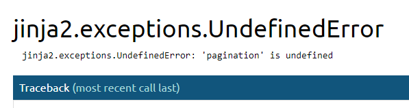

> This was resolved by declaring "recipes_paginated" and "pagination" in the search funtion as well. At first this seemd to work. However when clicking on the button to go to the second page of when a query delivered more than 8 results, the following error came up:

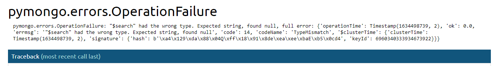

> This was solved by rewriting the search function, using $text-operators. I found the solution on the way to go at [StackOverflow](https://stackoverflow.com/questions/64214477/how-i-can-solve-this-problem-pymongo-errors-operationfailure).

[Back to table of content](#table-of-content)

---

- When attempting to implement a modal as a defensive mechanism so the admin doesn't accidentally delete a cuisine type, the following jinja error occurred: 

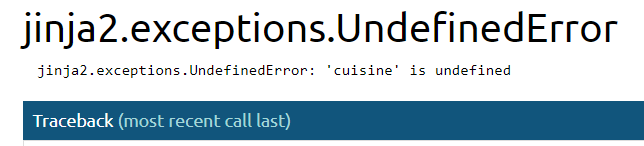

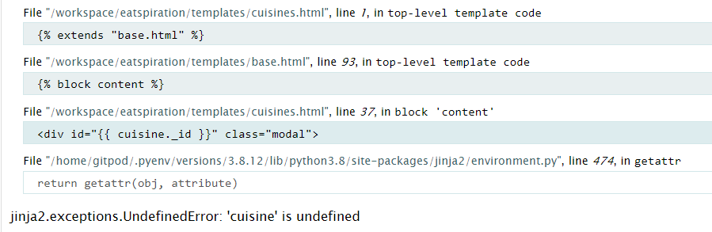

> Somehow the routing was wrong, so I changed whatever seemed to make sense at the time. Unfortunately I was unable to correct the error this way. Eventually I deleted the existing code and then rewrote it, after which it did work as intended.

[Back to table of content](#table-of-content)

## Documentation of any open bugs 

- When editing a recipe, the category sets itself to default.

[Back to table of content](#table-of-content)

[Back to README.md](https://github.com/nowane/eatspiration/blob/main/README.md)

[Back to Repository](https://github.com/nowane/eatspiration)